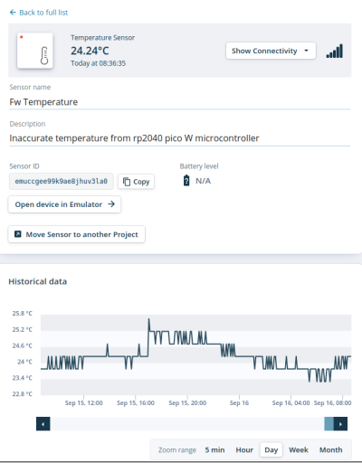

# pico-sensor

Using the Raspberry Pi Pico (W) as an IoT sensor.



## `transmit.py`

Sends a temperature reading every 5 minutes to a "virtual cloud connector" app service, which verifies and forwards the event to DT cloud, where it is represented as an emulated DT temperature sensor.

The receiving service expects a [JWT](https://jwt.io/) in the http header. See the schema e.g. [here](https://fw-dt-vccon.azurewebsites.net/redoc).

Messages are authenticated using a HMAC JWT token, and will be rejected by the server if not valid. The shared key is stored in a json file along with the Wifi SSID and password.

### setup

Create a virtualenv and install `rshell`. Create a `secrets.json` file adding your secrets:

```json
{
  "WIFI_SSID": "...",
  "WIFI_PASS": "...",
  "FW_VCCON_SIGNATURE_SECRET": "..."
}
```

To run, start rshell, then

```sh
cp transmit.py /pyboard
cp secrets.json /pyboard
repl
>>> import transmit
```

To make the file run automatically when the device is powered up, create a file called `main.py` with the following content

```py
import transmit
```

and copy to `/pyboard` (using rshell as above). Just delete this file if you want to disable automatic execution.

### testing

Run the file `test_transmit.py` locally (noting your ip address). You may need to install extra deps e.g. Pydantic. Change the url (and probably the update interval) to this address in transmit.py.

### TODO

- [ ] set unique hostname once micropython allows this. Currently hard-coded to `PYBD`.
- [ ] set clock once connected to network. (Currently message is timestamped by the forwarding service.)
- [ ] add other sensors to the pico: VOCs, PMx

